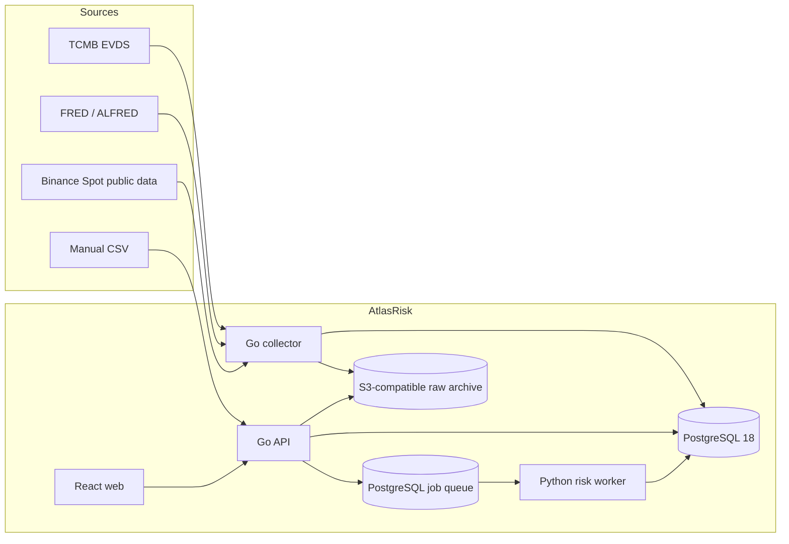

# System Architecture

## Architecture style

AtlasRisk is a monorepo and a modular monolith at the product boundary. It uses
three deployable processes because their runtime responsibilities and languages
differ, not because V1 needs distributed microservices:

- `api`: Go HTTP API and query/application layer
- `collector`: Go scheduled ingestion and normalization worker
- `risk-worker`: Python deterministic analytics worker
- `web`: React static frontend served separately in development and as built
  assets behind the deployment gateway

PostgreSQL is the system of record and the durable job queue. An S3-compatible
object store holds immutable raw payloads and import artifacts. No Kafka, Redis,
RabbitMQ, Temporal, or service mesh is used in V1.



## Repository target layout

```text
/
  apps/
    api/                  Go cmd/api and application modules
    collector/            Go cmd/collector
    web/                  React + TypeScript + Vite
  risk-engine/            Python package and worker entry point
  internal/               Shared private Go packages
  contracts/
    openapi/              Public HTTP contract
    jobs/                 Versioned JSON Schemas for async jobs/results
    imports/              CSV schemas and examples
  db/
    migrations/           Ordered SQL migrations
    queries/              sqlc query sources
  docs/
  infra/
    compose/              Local runtime
  test/
    contract/
    integration/
    e2e/
    fixtures/
  .ai/                    Vendor-neutral task and handoff artifacts
  .codex/                 Optional Codex execution profile
```

## Technology baseline

Exact patch versions are pinned by lockfiles and container digests during
bootstrap. Architecture documents specify supported major/minor lines and do not
drift with every patch release.

| Concern | Decision |
|---|---|
| Go | Go 1.27 line; standard `net/http`, `pgx`, `sqlc` |
| Python | CPython 3.14 line; `uv`, NumPy, pandas, SciPy, Pydantic, pytest |
| Database | PostgreSQL 18; plain tables and selective native partitioning |
| Migrations | Goose SQL migrations; one owner, forward-only in shared environments |
| HTTP contract | OpenAPI 3.1, contract-first; generated Go/TypeScript types |
| Job contract | Versioned JSON Schema envelope stored with every job |
| Frontend | React 19, TypeScript, Vite, React Router, TanStack Query, ECharts |
| UI implementation | CSS variables and CSS Modules; accessible headless primitives |
| JavaScript tooling | Current Node LTS pinned in bootstrap; npm lockfile |
| Task runner | Task (`Taskfile.yml`) as the cross-platform local/CI entry point |
| Raw archive | Garage 2.x by default; S3 API through AWS SDK for Go v2 |
| Local runtime | Docker Compose; localhost binding by default |
| Observability | Structured JSON logs, OpenTelemetry instrumentation, health endpoints |
| CI | GitHub Actions on Windows-independent Linux runners plus deterministic fixtures |

Go HTTP schemas use `oapi-codegen`; the web client uses Orval. Python validates
job JSON Schema at the boundary and maps it to explicit Pydantic models. Go tests
use the standard test package plus Testcontainers, Python uses pytest and
Hypothesis, and the web uses Vitest, Testing Library, and Playwright. These tool
versions are pinned during bootstrap.

TimescaleDB is explicitly deferred. The expected personal-system data volume does
not justify an extension, and hypertable unique constraints must include every
partitioning column, which complicates point-in-time identities. It may be added
only after query plans and retained volume demonstrate a need.

## Module ownership

### Go owns

- Source scheduling, rate limiting, retries, and raw-payload registration
- Normalization into source, series, observation, price, and FX records
- Application commands, HTTP authorization boundary, and query APIs
- Portfolio, journal, data-quality, valuation orchestration, and job lifecycle
- Database migrations and transaction boundaries

### Python owns

- Pure, versioned numerical functions
- Risk-matrix construction and coverage checks
- Volatility, correlation, drawdown, leverage, and concentration calculations
- Scenario revaluation and factor attribution
- Golden numerical fixtures and deterministic result serialization

Python does not expose a public HTTP service. It claims durable PostgreSQL jobs
using `FOR UPDATE SKIP LOCKED`, validates the versioned payload, reads immutable
input snapshots, and writes results in one idempotent completion transaction.

### React owns

- Presentation, navigation, input validation feedback, and explicit data-quality
  states
- No valuation, FX conversion, risk, or scenario business logic
- Server state through TanStack Query; local component state otherwise

## Contract and compatibility policy

- `/api/v1` is the only public HTTP namespace in V1.
- OpenAPI is the source of truth. Generated models are never hand-edited.
- Jobs use `{kind, schema_version, idempotency_key, input_snapshot_ids, payload}`.
- Unknown job schema versions fail permanently with an explicit error.
- Additive contract changes are preferred. Breaking changes require a new major
  contract version and migration plan.
- Database tables are not cross-language contracts; JSON Schema and stable query
  interfaces are.

## Durable jobs

Jobs have `queued`, `running`, `succeeded`, `retryable_failed`, `failed`, and
`cancelled` states. Claims have a lease expiry and attempt count. Idempotency keys
prevent duplicate semantic runs. Exponential backoff includes jitter and a
configured maximum attempt count. A crashed worker can be recovered after lease
expiry without producing duplicate results.

PostgreSQL queueing is a deliberate V1 simplification. Move to an external queue
only when measured contention, delivery volume, or independent scaling requires
it.

Collector schedules are durable database records claimed by collector instances;
they are not OS cron entries. Each schedule stores source, window, next due time,
policy version, and last completed checkpoint. The same lease/idempotency rules as
other durable work prevent duplicate semantic ingestion.

## Security and deployment boundary

- Containers run as non-root with read-only application filesystems where viable.
- Secrets enter through environment/file injection and never through repository
  defaults, logs, or task reports.
- Source credentials are read-only data keys. Binance uses the public market-data
  endpoint and requires no trading key.
- Imported files have size/type limits and are parsed as data, never executed.
- Raw payload downloads use allowlisted source hosts and bounded response sizes.
- Database and object storage are not exposed outside the Compose network.
- Backups include PostgreSQL plus the object archive; restore testing is part of
  release readiness.
