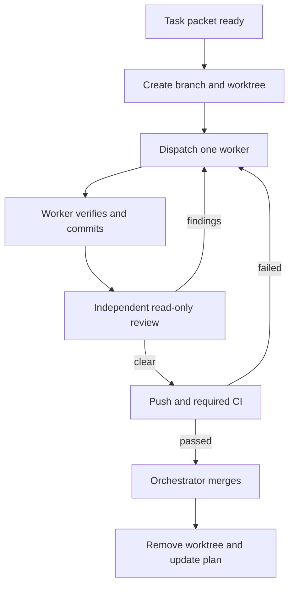

# Agent Execution Protocol

## Roles

### Orchestrator

The orchestrator owns requirements, sequencing, task readiness, worktree creation,
worker dispatch, review, integration, and final reporting. It does not implement a
task that can be delegated. In Codex the configured profile is `gpt-5.6-sol` with
medium reasoning.

### Task worker

A worker receives one ready task packet, one branch, and one worktree. It may edit
only owned paths plus explicitly listed shared paths. It does not spawn agents or
change accepted decisions. In Codex this role uses `gpt-5.6-luna` with high
reasoning.

### Task reviewer

A reviewer is read-only and checks the branch against the packet, ADRs, actual
diff, and tests. It reports blocking findings without editing. It is a separate
context from the implementation worker.

The role definitions are portable. Other AI systems map their strongest planning
model to orchestrator and a fast, tool-capable coding model to worker/reviewer.

## Git and worktree protocol

1. Keep the primary checkout on clean `main`.
2. Pull/fast-forward `main` before creating a task branch.
3. Create branch `task/AR-NNN-short-slug` from the exact current `main` SHA.
4. Create a sibling worktree under `../atrisk-worktrees/AR-NNN-short-slug`.
5. Record the base SHA in the task packet or orchestration log.
6. Dispatch exactly one writer to the worktree.
7. Worker commits, pushes only its task branch, and leaves the tree clean.
8. Reviewer checks the diff against `main` and returns findings.
9. Worker fixes findings on the same branch; do not create repair branches.
10. Orchestrator verifies required checks, opens/updates the PR, and merges only
    after all required checks pass.
11. Remove the worktree and local task branch after merge; retain the remote PR
    history.

No direct pushes to `main`, force pushes, shared writable worktrees, or unrelated
changes are permitted. A rebase/merge conflict is resolved by the orchestrator or
reassigned explicitly; a worker must not guess through another task's changes.

## Parallel dispatch rules

- Maximum three active subagents.
- Parallel tasks must have satisfied dependencies and disjoint `owned_paths`.
- Database migrations are serialized even when filenames differ.
- OpenAPI, shared generated clients, root toolchain files, and GitHub workflows
  are serialized shared paths.
- A write task and its reviewer do not run concurrently on a changing branch.
- Read-only exploration may run in parallel with a writer if it does not consume
  uncommitted state as authoritative.



## Dispatch prompt contract

Every dispatch must include:

```text
Task: AR-NNN
Packet: absolute-or-repository-relative path
Branch: task/AR-NNN-short-slug
Worktree: absolute path
Base SHA: full SHA
Read first: AGENTS.md and listed ADRs
Return: .ai/REPORT_TEMPLATE.md fields
Stop conditions: decision conflict, scope ambiguity, unsafe migration, missing dependency
```

Do not paste a parallel alternative specification into the prompt. The task packet
remains the source of truth so another AI can resume without chat history.

## Task lifecycle

`draft -> ready -> active -> review -> merged`

`blocked` may be entered from `active` or `review` with a concrete blocking
condition. Only the orchestrator changes lifecycle status. A task is not complete
because code exists; it is complete when acceptance evidence, verification,
review, clean Git state, and merge status are recorded.

## Integration gates

- Formatting, lint, static analysis, unit tests
- Contract generation has no diff after regeneration
- Database migration verification from empty and previous schema
- Integration tests against real PostgreSQL and S3-compatible storage
- Numerical golden tests and accounting reconciliation
- Web typecheck/build/component tests
- End-to-end proof for affected user journey
- Secret scan and dependency vulnerability checks
- Required GitHub checks complete, not merely started

## Failure handling

- Retry infrastructure/transient failures only after capturing the exact error.
- Do not retry deterministic test failures without a code or fixture change.
- A worker blocked by a missing architecture decision stops and returns a proposed
  decision question; it does not create an ADR unasked.
- If a task touches paths owned by an active task, pause it until the conflict is
  removed or re-plan ownership.
- If system output cannot be reconciled, fail closed and preserve input evidence.
