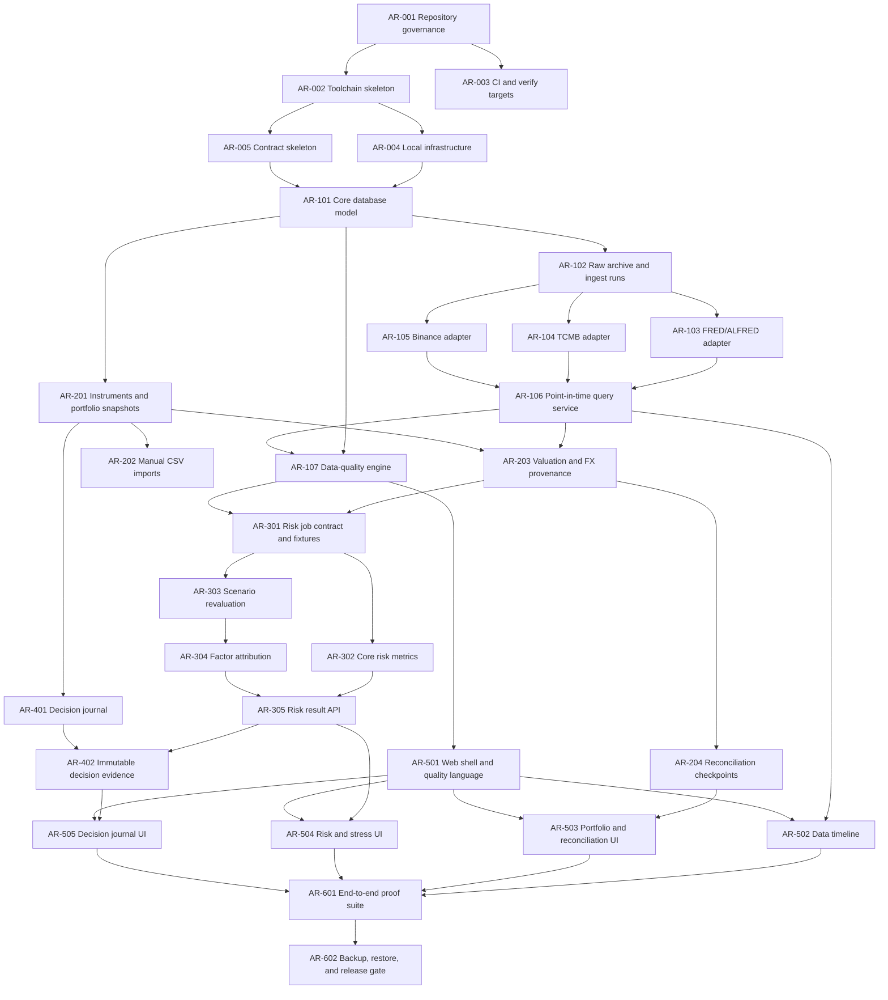

# AtlasRisk Master Implementation Plan

## Planning rules

- This plan begins only after architecture acceptance.
- Each task becomes an individual `.ai/tasks/AR-NNN-*.md` packet before dispatch.
- A phase exit is an evidence gate, not a calendar date.
- Workers implement one task at a time. The orchestrator may dispatch at most
  three independent tasks with disjoint paths.
- `task verify` becomes the single local aggregate gate in AR-003.

## Dependency overview

## Phase 0: Repository and contracts

### AR-001 Repository governance

Create branch protection documentation, contribution rules, issue/PR templates,
CODEOWNERS, secret policy, and the task tracking directory. Prove that no normal
workflow writes directly to `main`.

### AR-002 Toolchain skeleton

Create the Go 1.27 module, Python 3.14 `uv` project, React 19 TypeScript app, exact
tool pins, dependency lockfiles, formatting/lint/typecheck configuration, and a
minimal build for each component. No domain feature code.

### AR-003 CI and verification targets

Create Taskfile.yml targets for format check, generated-file check, lint, static
analysis, unit, integration, contract, web build, and aggregate `task verify`.
Create GitHub Actions with caching and cancellation but no deployment.

### AR-004 Local infrastructure

Provide Docker Compose for PostgreSQL 18 and an S3-compatible development store,
health checks, non-secret example configuration, migration commands, and isolated
test services. Bind application ports to localhost.

### AR-005 Contract skeleton

Create OpenAPI 3.1 and JSON Schema generation/validation pipelines, error envelope,
pagination/cursor conventions, idempotency headers, and generated-code drift gate.

**Exit evidence:** a clean clone can build every component, start dependencies,
run `task verify`, and regenerate contracts without a diff.

## Phase 1: Point-in-time data platform

### AR-101 Core database model

Implement sources, datasets, series, instruments, ingestion runs, raw objects,
observation/price/FX revisions, exact numeric types, and append-only constraints.
Prove migration up from empty and schema-level immutability.

### AR-102 Raw archive and ingestion framework

Implement content-addressed S3 writes, secret-safe request metadata, idempotent
ingest runs, bounded HTTP client behavior, adapter interface, retry policy, and
fixtures that replay without network access.

### AR-103 FRED/ALFRED adapter

Ingest selected series, metadata, real-time intervals, and vintages. Prove a
revision remains queryable under historical source-as-of and system-as-of cutoffs.

### AR-104 TCMB EVDS adapter

Ingest selected macro/FX series, preserve units/frequency, and represent absent
publication precision honestly. Prove delayed/missing periods affect quality.

### AR-105 Binance Spot adapter

Use public market-data-only endpoints for instrument metadata and daily klines.
Implement request-weight throttling and timestamp normalization. No API key or
private endpoint is permitted.

### AR-106 Point-in-time query service

Expose latest, source-as-of, and system-as-of queries with explicit semantics,
provenance, pagination, and stable ordering. Add cross-source timeline queries.

### AR-107 Data-quality engine

Implement expected-frequency calendars, freshness rules, missing/partial/suspect
classification, run-level valid/degraded/blocked aggregation, and reason codes.

**Exit evidence:** the revision, delayed-data, raw-provenance, and no-false-green
requirements pass through API-level integration tests.

## Phase 2: Portfolio and valuation

### AR-201 Instruments and portfolio snapshots

Implement accounts, portfolios, immutable position snapshots/lines, supported
instrument classes, risk attributes, and native/TRY/USD base configuration.

### AR-202 Manual CSV imports

Define and implement preview-then-commit imports for positions and manual price
history. Reject ambiguous currencies, duplicate identities, formula injection,
invalid precision, and unsupported date formats with row-level errors.

### AR-203 Valuation and FX provenance

Implement cutoff/freshness-aware price selection, deterministic direct/USD-bridge
FX paths, exact line/NAV valuation, and persisted quote lineage. Prove identical
inputs reproduce identical valuations.

### AR-204 Reconciliation checkpoints

Implement external NAV checkpoints, default/configured tolerances, line and total
differences, and explicit unreconciled state.

**Exit evidence:** fixture portfolios reconcile in TRY and USD; stale/unpriced
lines block completeness; every number traces to position, price, and FX IDs.

## Phase 3: Risk and stress engine

### AR-301 Risk job contract and golden fixtures

Implement durable job claiming, leases, attempts, idempotency, versioned schemas,
immutable input bundles, deterministic serialization, and language-neutral golden
fixtures shared by Go and Python tests.

### AR-302 Core risk metrics

Implement return alignment, volatility, correlation with coverage, drawdown,
gross/net leverage, top weights, and HHI. Cover constant series, missing windows,
negative NAV, and calendar edge cases.

### AR-303 Scenario revaluation

Implement immutable scenario versions, the three V1 templates, spot and duration/
convexity revaluation, mapping coverage, post-shock metrics, and blocked states.

### AR-304 Factor attribution

Implement exact position reconciliation, Shapley factor contributions for the V1
factor set, interaction residuals, numerical tolerances, and property/golden tests.

### AR-305 Risk result API

Expose job submission/status, risk results, stress results, attribution, quality,
engine/schema versions, and input snapshot links without leaking internal tables.

**Exit evidence:** total stress P&L reconciles to positions and factors; repeated
runs with identical versions produce byte-stable canonical result payloads.

## Phase 4: Decision journal

### AR-401 Decision journal

Implement decisions, thesis, alternatives, invalidation rules, horizon, risk
budget, intended action, tags, and append-only reviews/amendments.

### AR-402 Immutable decision evidence

Seal portfolio, data, valuation, risk, and scenario references at decision time.
Implement reconstruction and prove later revisions do not change the old view.

**Exit evidence:** a historical decision opens with exactly its original evidence
and a later review is visibly separate.

## Phase 5: Web application

### AR-501 Web shell and quality language

Build navigation, accessible design tokens/components, loading/empty/error states,
quality badges, cutoff selector, and generated API client integration.

### AR-502 Data timeline

Build series search, latest/source-as-of/system-as-of views, revision comparison,
freshness, and raw provenance navigation.

### AR-503 Portfolio and reconciliation UI

Build manual snapshot/import flows, valuation tables, native/TRY/USD switching,
FX path inspection, and reconciliation states.

### AR-504 Risk and stress UI

Build risk coverage, volatility/correlation/drawdown/concentration views, scenario
selection, loss waterfall, factor attribution, and unmapped-input warnings.

### AR-505 Decision journal UI

Build create/review journeys with evidence preview, sealed snapshot indicators,
invalidation criteria, and historical reconstruction.

**Exit evidence:** every core journey is usable by keyboard, handles empty/loading/
error/degraded states, and never hides quality or provenance behind a tooltip only.

## Phase 6: System proof and release readiness

### AR-601 End-to-end proof suite

Automate the four product proofs: non-destructive revision, reproducible valuation
and reconciliation, no false-green missing data, and explainable stress loss.
Include a complete create-portfolio -> ingest -> value -> stress -> decide ->
review journey using deterministic fixtures.

### AR-602 Backup, restore, and release gate

Implement database/object-store backup and restore verification, migration from the
previous release, dependency/secret scans, SBOM, operational runbook, and signed
release checklist. No production deployment is implied.

**Exit evidence:** a fresh environment and a restored environment produce the same
sealed decision reconstruction and calculation hashes.

## Deferred roadmap

- ECB SDMX adapter
- Broker read-only synchronization and TradeLedger integration
- Transaction ledger, lots, realized P&L, corporate actions
- Derivatives and nonlinear pricing
- VaR/CVaR, Monte Carlo, optimization, and backtesting
- Optional sourced-news/thesis LLM enrichment with separate trust labeling
- Multi-user deployment only after a dedicated identity/tenancy threat model
